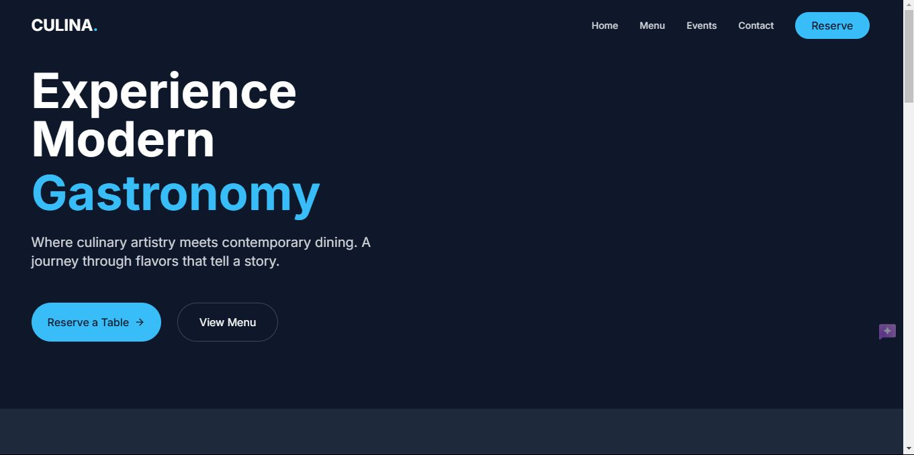
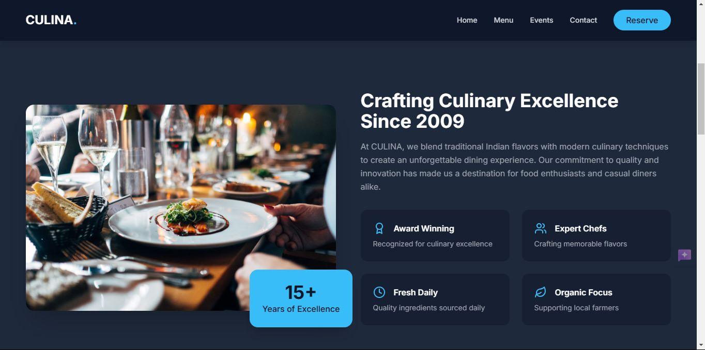
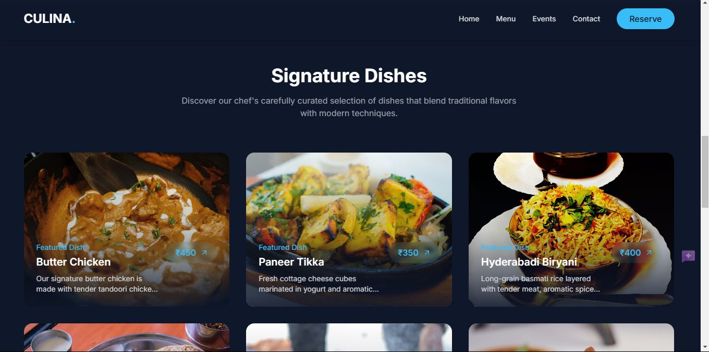

Here is the formatted text for your GitHub README file:

# **Pinnacle Labs Web Development Internship**

## **Overview**
 
 
## **Task 1: Personal Portfolio Website**

https://github.com/user-attachments/assets/cd241b64-98b6-4598-8057-68d98a556209

### **Description**
For the first task, I built a Personal Portfolio Website. This beginner-level project involved HTML, CSS, and a bit of JavaScript to showcase my projects and skills.

### **Features**
- **HTML & CSS**: Structured and styled the webpage.
- **JavaScript**: Added interactivity to the portfolio.
- **Responsive Design**: Ensured the website is mobile-friendly.

### **Highlights**
- Easy and straightforward project.
- Great way to kickstart my journey in Full Stack Web Development.

## **Task 2: Restaurant Website Development**
  
### **Description**
The second task involved creating a comprehensive dining platform with interactive menus, a seamless reservation system, and engaging event details.

### **Features**
- **HTML, CSS, JavaScript**: Developed the frontend.
- **Node.js**: Implemented backend functionalities.
- **Responsive Design**: Ensured perfect viewing across all devices.

### **Highlights**
- Enhanced customer dining experiences through intuitive navigation and user-friendly features.

## **Task 3: E-commerce Website Development**

https://github.com/user-attachments/assets/30a27e83-64d1-4a34-90c9-e797aa66244a

### **Description**
The third task was to develop an E-commerce Website. This project showcases a comprehensive online shopping platform with interactive product listings, smart recommendations, and a seamless shopping cart experience.

### **Features**
- **Dynamic Product Recommendations**: Based on user preferences.
- **Secure Shopping Cart**: Ensured secure transactions.
- **Streamlined Checkout Process**: Simplified the purchasing experience.
- **Responsive Design**: Compatible with all devices.

### **Highlights**
- Created an intuitive shopping experience.
- Gained valuable experience in full stack development.

## **Acknowledgements**
I would like to thank Pinnacle Labs IT Solutions for providing this amazing learning opportunity. Special thanks to the mentors and team members for their guidance and support throughout the internship.

## **Contact**
For any queries or further information, feel free to reach out to me:

- **LinkedIn**: D ABHISHEK YADAV - https://www.linkedin.com/in/dabhishekyadav/
- **Email**: d.abhishekyadav2004@gmail.com

